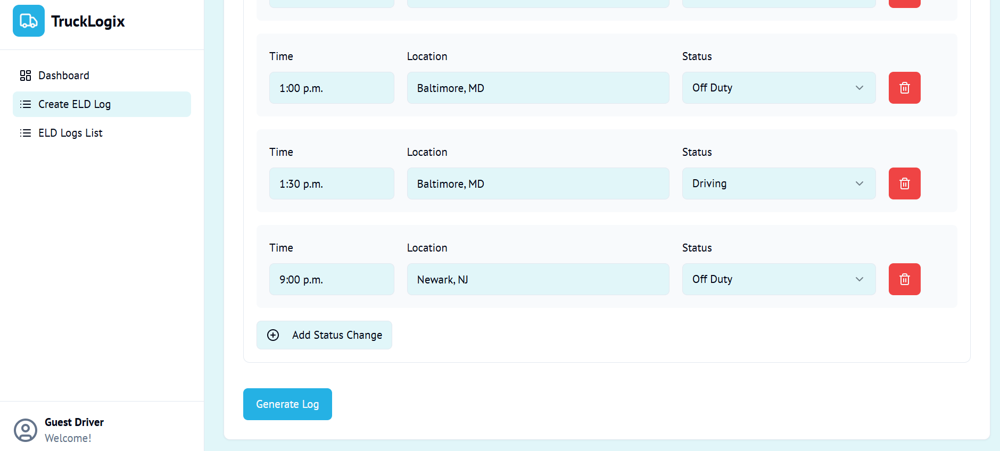

# TruckLogix 🚛

A comprehensive trucking logistics application that combines intelligent route optimization with compliant ELD (Electronic Logging Device) log generation, powered by AI technology.


## 🌟 What TruckLogix Does

TruckLogix is designed to streamline the daily operations of truck drivers and fleet managers by providing two core functionalities:

### 1. **Intelligent Route Optimization** 🗺️
- **Smart Route Planning**: Input your current location, pickup point, and destination to get optimized routes
- **Fuel Stop Recommendations**: Automatically suggests fuel stations along your route based on real-time data
- **Rest Break Planning**: Identifies optimal rest stops considering Hours of Service (HOS) regulations
- **Interactive Maps**: Visual route display with all stops clearly marked
- **Time & Fuel Estimates**: Accurate predictions for travel time and fuel consumption

### 2. **ELD Log Generation & Management** 📋
- **Automated Log Creation**: Generate compliant daily logs with visual timeline representations
- **HOS Compliance**: Automatic calculation of remaining driving and on-duty hours
- **Visual Timeline**: Interactive timeline showing duty status changes throughout the day
- **Log History**: Browse, view, and manage all your previous ELD logs
- **Regulatory Compliance**: Ensures all logs meet FMCSA ELD regulations

## 🎥 Demo & Screenshots

### Route Optimization in Action


*Watch how TruckLogix optimizes your route with fuel and rest stops*

### ELD Log Creation





### ELD Log Generation


### Log Management


## 🤖 AI-Powered Features

TruckLogix leverages advanced AI technology to enhance the trucking experience:

### **Smart ELD Log Generation**
- **Automated Compliance**: AI ensures all generated logs comply with federal HOS regulations
- **Error Prevention**: Intelligent validation prevents common logging mistakes
- **Natural Language Processing**: Converts complex regulatory requirements into user-friendly interfaces


## 🚀 Key Features

### Dashboard
- **Clean Interface**: Modern, driver-friendly design optimized for in-cab use
- **Quick Access**: One-click access to route planning and log generation
- **Status Overview**: At-a-glance view of current HOS status and upcoming requirements

### Route Planner
- **Multi-point Planning**: Support for complex routes with multiple stops
- **Export Options**: Save and share route information

### ELD Management
- **Comprehensive Logging**: Track all duty status changes with precise timestamps
- **Visual Representation**: Timeline view makes it easy to understand daily activities
- **Bulk Operations**: Manage multiple logs efficiently
## 🛠️ Technology Stack

### Frontend
- **React + Next.js 15** - React framework for production
- **TypeScript** - Type-safe development
- **Tailwind CSS** - Utility-first styling
- **Shadcn/ui** - Modern component library
- **React Leaflet** - Interactive maps
- **React Hook Form** - Form management

### Backend
- **Django REST Framework** - Robust API development
- **OpenRouteService** - Real-time routing and geocoding
- **SQLite** - Lightweight database for development
- **Python** - Backend logic and data processing

### AI Integration
- **Google AI (Gemini)** - Advanced language model for intelligent features
- **Genkit** - AI workflow orchestration

## 📱 User Experience

### For Drivers
1. **Start Your Day**: Open TruckLogix and input your trip details
2. **Get Your Route**: Receive an optimized route with all necessary stops
3. **Track Your Time**: Log duty status changes throughout the day
4. **Stay Compliant**: Automatic HOS calculations keep you legal
5. **End of Day**: Generate your daily ELD log with one click

## 🎯 Benefits

### **Efficiency Gains**
- **Time Savings**: Reduce route planning time by 75%
- **Fuel Optimization**: Save up to 15% on fuel costs
- **Reduced Paperwork**: Eliminate manual log creation

### **Compliance Assurance**
- **Zero Violations**: AI-powered compliance checking
- **Audit Ready**: All logs meet regulatory standards
- **Real-time Monitoring**: Instant alerts for potential violations

### **Driver Satisfaction**
- **User-Friendly**: Intuitive interface designed for drivers
- **Stress Reduction**: Automated compliance removes guesswork
- **Better Planning**: Optimal routes mean more predictable schedules

## 🔧 Installation & Setup

### Prerequisites
- Node.js 20.x or higher
- Python 3.10 or higher
- OpenRouteService API key

### Frontend Setup
```bash
# Clone the repository
git clone <repository-url>
cd trucklogix

# Install dependencies
npm install

# Set up environment variables
cp .env.example .env.local
# Add your API keys and configuration

# Start development server
npm run dev
```

### Backend Setup
```bash
# Navigate to backend directory
cd backend

# Create virtual environment
python -m venv venv
source venv/bin/activate  # On Windows: venv\Scripts\activate

# Install dependencies
pip install -r requirements.txt

# Set up environment variables
cp .env.example .env
# Add your OpenRouteService API key

# Run migrations
python manage.py migrate

# Start development server
python manage.py runserver
```

## 🌐 API Integration

TruckLogix integrates with several external services:

- **OpenRouteService**: Real-time routing and geocoding
- **Google AI**: Intelligent log generation and route optimization
- **Fuel Price APIs**: Current fuel pricing data
- **Traffic APIs**: Real-time traffic conditions


## 🤝 Contributing

We welcome contributions to TruckLogix! Please read our contributing guidelines and submit pull requests for any improvements.

## 📄 License

This project is licensed under the MIT License - see the LICENSE file for details.
